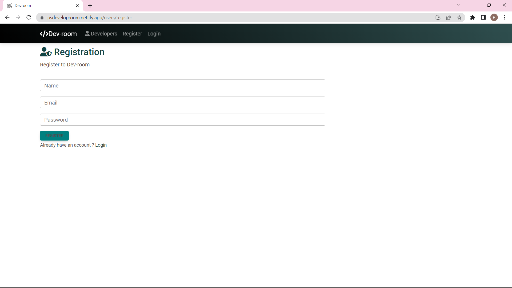
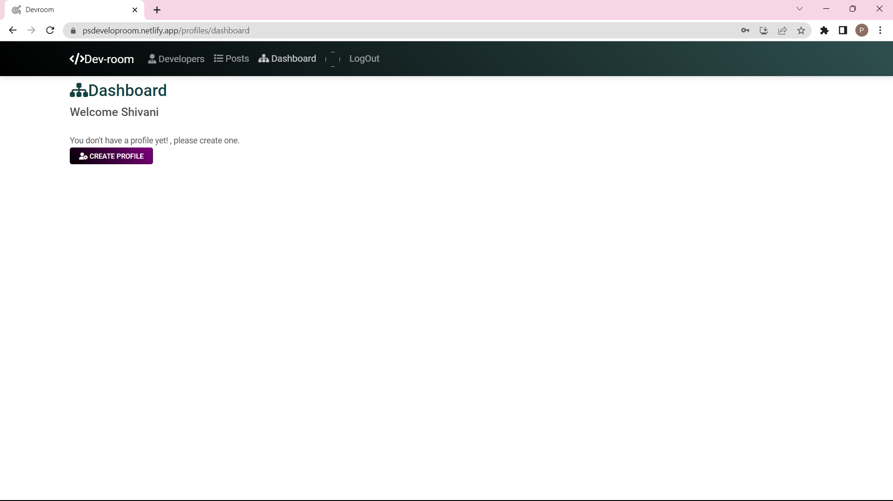
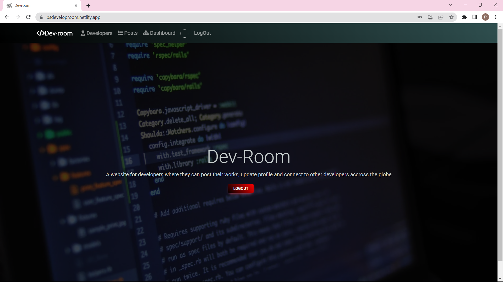
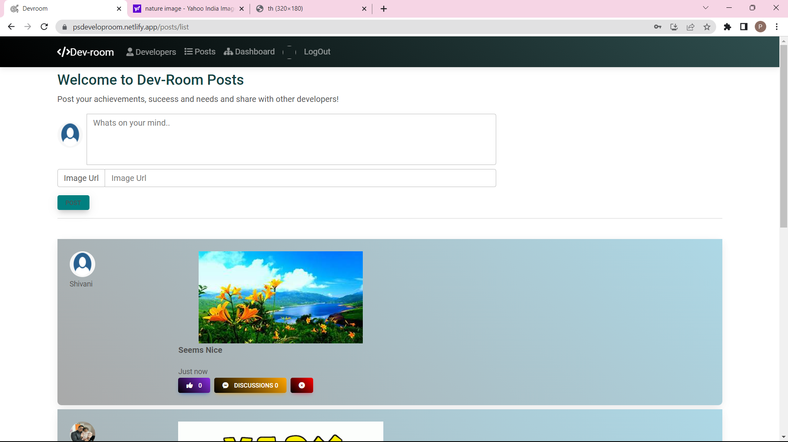
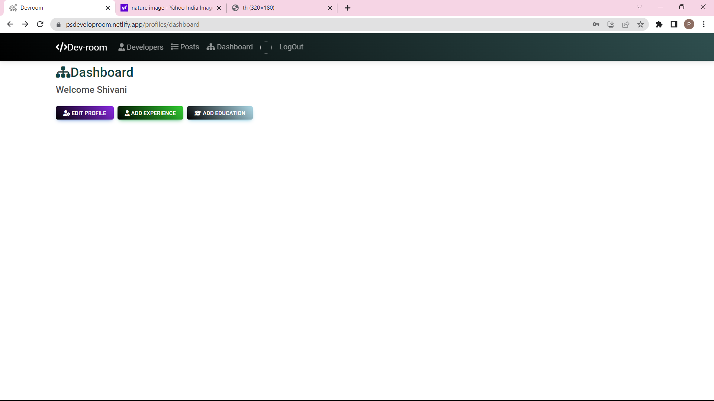

# Developer Room App

# Features

1. Users can login and register.

2. They can create,update and delete the profiles,experience and education to 
keep it latest updated.

3. Users can also view the profile of other developers registered in this platform.

4. They can also post text,post text with image,like and comment on the post and can also view the post posted by other developers.

5. User can also delete their own posts and comments.

This is a web application where developers can connect, share their profiles, experiences, education, and interact with other developers.

## Tech Stack used: 

 Frontend:-
HTML
,CSS
,JavaScript
,React.js

 Backend:
Node.js
,MongoDB

## Deployment
Render and Netlify

## Contribution
Contributions are welcome! If you would like to contribute to any of the projects, please follow these steps:

1.Fork the repository.

2.Create a new branch for your feature or bug fix.

3.Make your changes and commit them.

4.Push your changes to your forked repository.

5.Submit a pull request to the main repository.

## Here's some images of the project!

