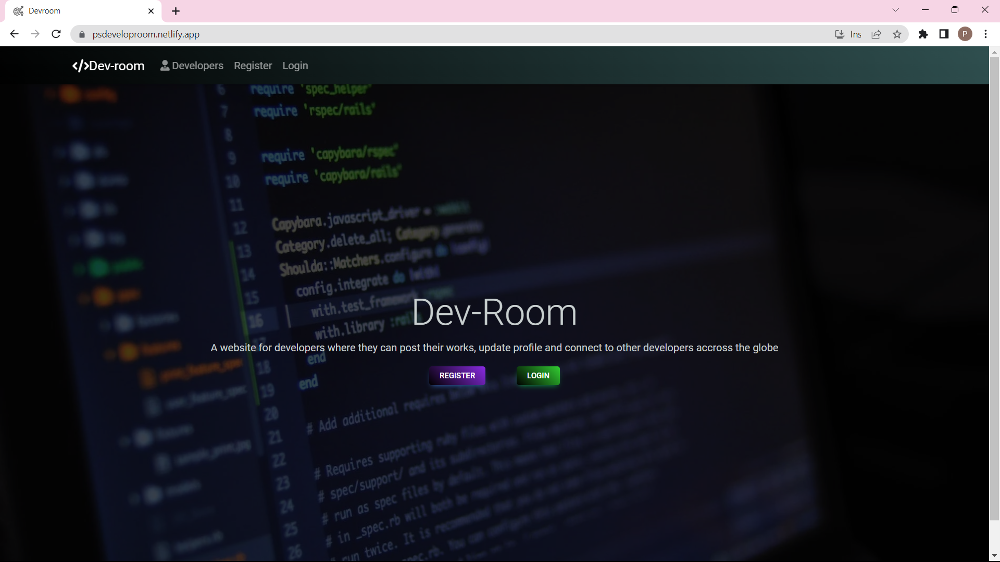

# Developer Room App

This is a web application where developers can connect, share their profiles, experiences, education, and interact with other developers.

# Features

## User Authentication:

Users can register and log in to the platform.

## Profile Management:

Users can create, update, and delete their profiles, including experiences and education.
Profiles are kept up-to-date with the latest information.

## Developer Profiles:

Users can view the profiles of other registered developers on the platform.

## Social Interaction:

Users can post text and text with images.
Users can like and comment on posts made by other developers.
Users can delete their own posts and comments.

## Tech Stack used: 

 Frontend:-
HTML
,CSS
,JavaScript
,React.js

 Backend:
Node.js
,MongoDB

## Deployment
Render and Netlify

## Website link https://psdeveloproom.netlify.app/

## Contribution
Contributions are welcome! If you would like to contribute to any of the projects, please follow these steps:

1.Fork the repository.

2.Create a new branch for your feature or bug fix.

3.Make your changes and commit them.

4.Push your changes to your forked repository.

5.Submit a pull request to the main repository.

## Here's some images of the project!

